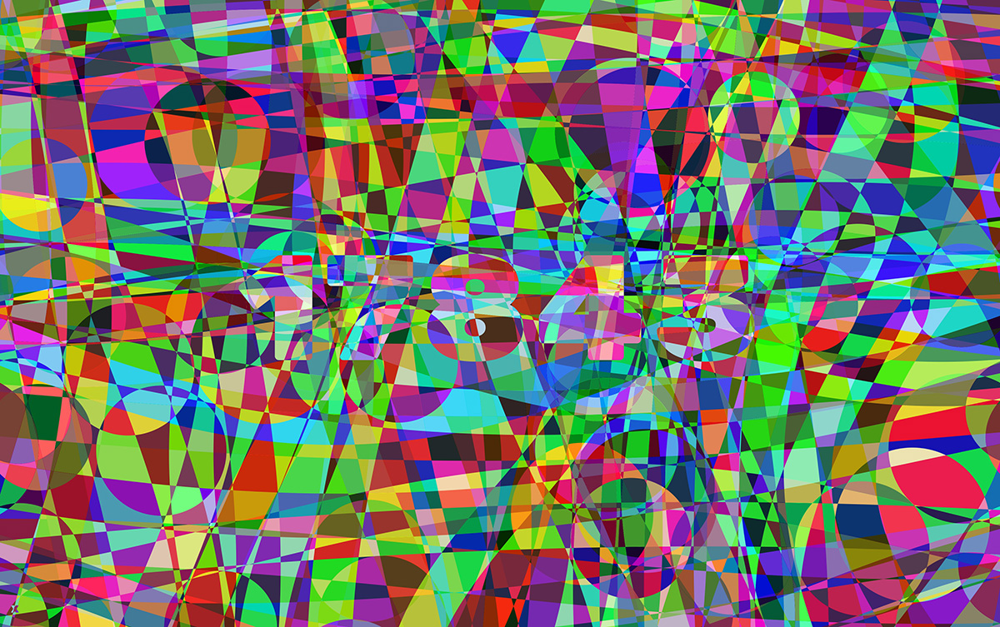
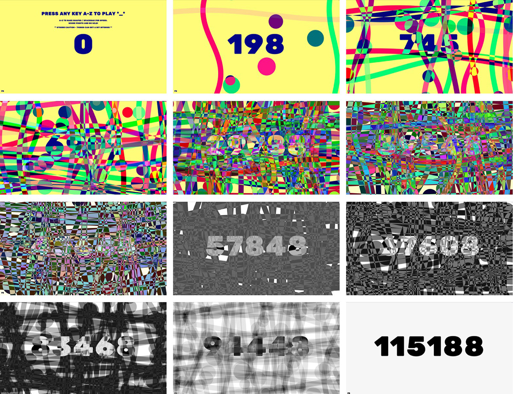

# PRESS ANY KEY TO PLAY \*_\*

## Description

Press any key to play *_* is an interactive p5.js sketch that transforms typing into a system of compulsive visual feedback. Instead of producing letters, each keystroke generates geometric shapes that accumulate, accelerate and eventually degrade. What begins as joyful interaction quickly becomes intense and overwhelming: a score climbs endlessly, visuals become chaotic and the system decays without constant attention. This project explores gamification's shadow side, examining how reward systems designed to engage can tip into exhaustion, and how the pleasure of interaction can become compulsive and all-consuming.

## How to Run / Install

Live demo here - https://lab.paulcalver.cc/work/shapes/

## Concept / Intent

The project explores the Action > Feedback > Motivation > Action loop underpinning gamification mechanics. While researching productivity culture, I became fascinated by how reward systems serve both user satisfaction and corporate gain. We spend hours organising to-do lists in apps like Notion, with organisation becoming a task itself whilst actual goals remain unachieved.

This phenomenon has several names: "Meta-work" describes organising and planning that eclipses actual task completion (Personal Growth Map, 2009). "Yak shaving", coined by MIT researcher Carlin Vieri (2000), refers to fiddly tasks bearing no obvious relationship to your goal but linked through causal relations. "Structured procrastination" describes doing marginally useful things as a way of avoiding more important work (Perry, 1996).
Academic research reveals gamification operates through self-determination theory, where badges, leaderboards and performance graphs affect competence need satisfaction (Sailer et al., 2017). However, recent studies identify failure modes including "shallow gamification" (superficial application) and the "overjustification effect" where excessive rewards harm intrinsic motivation.
Game designer Ian Bogost (2011) argues gamification is "exploitationware", mistaking incidental properties like points for primary features like behavioural complexity. This critique informed my approach: rather than condemning these mechanics, I wanted users to experience them viscerally.
I drew inspiration from Patatap by Jono Brandel (2014), which demonstrates keystroke-to-visual mapping joy. Where Patatap remains pleasurable, my system intentionally crosses into discomfort, exploring what Flanagan (2009) calls "critical play." Flanagan warns that games commenting on societal issues risk "becoming either dull and didactic, or entertaining but hollow" (Flanagan, 2009, p.6). I aimed to keep the work joyful whilst building critique into the experience itself.

## Technology Used

Made using p5.js

## Screenshots / Media

## Credits / Acknowledgements

Paul Calver - Jan 2026

## Contact / Links

GitHub Repo – https://github.com/paulcalver/press.any.key.to.play.git  
Demo URL - https://lab.paulcalver.cc/work/shapes/  
Website - https://lab.paulcalver.cc/  
Social - https://instagram.com/calvercalver  
Email - [paulcalver@me.com](mailto:paulcalver@me.com).